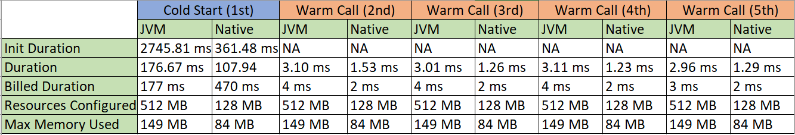

= Deploying a Camel Route in AWS Lambda : A Camel Quarkus example
:cq-example-description: An example that shows how to deploy a Camel Quarkus route as an AWS Lambda function

{cq-description}

TIP: Check the https://camel.apache.org/camel-quarkus/latest/first-steps.html[Camel Quarkus User guide] for prerequisites
and other general information.

== Start in Development mode

In development mode, Quarkus boots up a mock AWS Lambda event server. For further information about how to feed it
with mock events, refer to the https://quarkus.io/guides/amazon-lambda#live-coding-and-unitintegration-testing[Quarkus AWS Lambda] guide.

[source,shell]
----
$ mvn clean compile quarkus:dev
----

The above command compiles the project, starts the application and lets the Quarkus tooling watch for changes in your
workspace. Any modifications in your project will automatically take effect in the running application.

TIP: Please refer to the Development mode section of
https://camel.apache.org/camel-quarkus/latest/first-steps.html#_development_mode[Camel Quarkus User guide] for more details.

=== Package and run the application

Once you are done with developing you may want to package and run the application.

TIP: Find more details about the JVM mode and Native mode in the Package and run section of
https://camel.apache.org/camel-quarkus/latest/first-steps.html#_package_and_run_the_application[Camel Quarkus User guide]

==== JVM mode

[source,shell]
----
$ mvn clean package -DskipTests
$ java -jar target/quarkus-app/quarkus-run.jar
----

==== Native mode

IMPORTANT: Native mode requires having GraalVM and other tools installed. Please check the Prerequisites section
of https://camel.apache.org/camel-quarkus/latest/first-steps.html#_prerequisites[Camel Quarkus User guide].

To prepare a native executable using GraalVM, run the following command:

[source,shell]
----
$ mvn clean package -DskipTests -Pnative
$ ./target/*-runner
----

=== Extra Build Generated Files

[NOTE]
====
After you run the build, there are a few extra files generated by the quarkus-amazon-lambda extension. These files are in the build directory: `target/`
====

* function.zip - lambda deployment file

* manage.sh - wrapper around aws lambda cli calls

* bootstrap-example.sh - example bootstrap script for native deployments

* sam.jvm.yaml - (optional) for use with sam cli and local testing

* sam.native.yaml - (optional) for use with sam cli and native local testing

[NOTE]
====
https://quarkus.io/guides/amazon-lambda#extra-build-generated-files[Please click here to know more on how to use these scripts for automated deployment]
====

== Deploying the Quarkus JVM application to AWS Lambda via AWS Web Console

1. Go to AWS Web console and search for Lambda Service
 
2. Click Create Function and select Author From Scratch 

3. Give the name for your function which should be unique

4. Select Java 11 (Corretto) as Runtime 

5. Under Permission feel free to create / use existing role to give the required permission for your lambda function

6. Once the function is created click the function name to upload the generated function.zip file and configure it. 

7. Scroll down and select the Code tab. Click the upload from dropdown on right-hand side of the screen and select .zip or .jar file 

8. Click upload and browse to the path where the generated zip file `target/function.zip` was created and select the function.zip file and click save

9. Under the Code tab scroll down to the Runtime settings and click edit 

10. For the Handler details please provide the Quarkus Handler 

[source,shell]
----
io.quarkus.amazon.lambda.runtime.QuarkusStreamHandler::handleRequest
----

=== Testing the AWS Lambda Function

1. Now select the Test tab for executing a quick test. Copy paste the below json payload and hit Test 

    {
     "name": "Ravishankar"
    }

2. If everything goes fine you should get the below response along with the lambda execution logs & stats

    Hello Ravishankar ! How are you? from GreetService

== Deploying the Quarkus Native executable to AWS Lambda via AWS Web Console

[NOTE]
====
<<package_native_executable,Please ensure that you have built your Java code as Quarkus Native executable>>
====

1. Go to AWS Web console and search for Lambda Service
 
2. Click Create Function and select Author From Scratch 

3. Give the name for your function which should be unique

4. For Runtime please scroll down and Select Provide your own bootstrap on Amazon Linux 2 under Custom Runtime 

5. Under Permission feel free to create / use existing role to give the required permission for your lambda function

6. Once the function is created click the function name to upload the generated function.zip file and configure it. 

7. Scroll down and select the Code tab. Click the upload from dropdown on right-hand side of the screen and select .zip or .jar file 

8. Click upload and browse to the path where the generated zip file `target/function.zip` was created and select the function.zip file and click save

9. Under the Code tab scroll down to the Runtime settings and click edit 

10. For the Handler details please provide the below Handler 

        not.used.in.provided.runtime

11. Then Select the Configuration tab and click Environment Variables 

12. For Key enter `DISABLE_SIGNAL_HANDLERS`	& for Value enter `true`

=== Testing the AWS Lambda Function

1. Now select the Test tab for executing a quick test. Copy paste the below json payload and hit Test 

    {
     "name": "Ravishankar"
    }

2. If everything goes fine you should get the below response along with the lambda execution logs & stats

    Hello Ravishankar ! How are you? from GreetService

== JVM vs Native : Results based on lambda execution logs & stats

