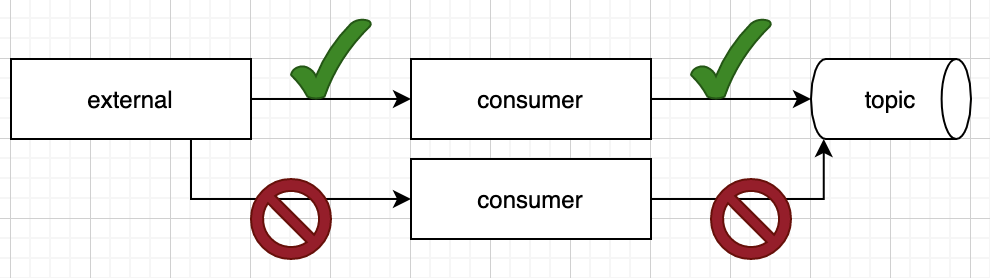

= Leader election in Kubernetes: A Camel Quarkus Master example
:cq-example-description: An example that shows how to use Camel master component.

{cq-description}

Suppose an application connects out to an external service and receives information asynchronously via a TCP socket or websocket. As part of this process, the application receives data, transforms the structure, and publishes that data into an https://developers.redhat.com/topics/kafka-kubernetes[Apache Kafka] topic. In this case, only a single connection can be active at one time because of the possibility of publishing duplicate data (see diagram below).

The quick solution to this problem is actually a fundamental characteristic of Kubernetes. If the deployment is created with the replicas set to 1, then when the controller detects the pod is no longer running, it will attempt to create a new one. However, real-world situations can be more complicated. Some applications require a long startup time due to cache warming needs. When you combine slow startup times (minutes) for the pod with business requirements to minimize the loss of downtime, the default solution becomes unsuitable. In this situation, we will want to have multiple instances up and ready to take over the consumption as quickly as possible.

This example shows you how to implement leader election in Kubernetes using Apache Camel.

== Hot-warm with leader election
To run an application as hot-warm means to have multiple instances of the application running and ready to serve requests, but only one instance actually doing the work. Within Kubernetes, this means having multiple pods ready at all times, but only one pod active for a particular process. In this scenario, the pods negotiate among themselves which one is active.

Apache Camel has a component (called master) that is built exactly for this scenario. As the docs explain, the Camel-Master endpoint lets us ensure only a single consumer in a cluster consumes from a given endpoint, with automatic failover if that Java virtual machine (JVM) dies. To achieve this goal, the endpoint requires a shared resource and locking. The component has multiple implementations for the locking mechanism, including camel-kubernetes.

Within the component's configuration, the developer provides a namespace to designate the shared resource. All processes that use the same namespace for the locking will ensure that only one process at a time obtains the lock. When a process has the lock, it is the leader, and the process will run. If it loses the lock for any reason, the component will stop the process, as well.

== Start in the Development mode

[source,shell]
----
$ mvn clean compile quarkus:dev
----

The above command compiles the project, starts the application and lets the Quarkus tooling watch for changes in your
workspace. Any modifications in your project will automatically take effect in the running application.

TIP: Please refer to the Development mode section of
https://camel.apache.org/camel-quarkus/latest/first-steps.html#_development_mode[Camel Quarkus User guide] for more details.

== Package the application for local playground

Once you are done with developing you may want to package and run the application.

TIP: Find more details about the JVM mode and Native mode in the Package and run section of
https://camel.apache.org/camel-quarkus/latest/first-steps.html#_package_and_run_the_application[Camel Quarkus User guide]

=== JVM mode

[source,shell]
----
$ mvn clean package
----

=== Native mode

IMPORTANT: Native mode requires having GraalVM and other tools installed. Please check the Prerequisites section
of https://camel.apache.org/camel-quarkus/latest/first-steps.html#_prerequisites[Camel Quarkus User guide].

To prepare a native executable using GraalVM, run the following command:

[source,shell]
----
$ mvn clean package -Pnative
----

== Local Playground

The first example uses the traditional Camel route domain-specific language (DSL), where we incorporate the master component along with the timer component (see link:src/main/java/org/acme/master/CamelRoute.java[CamelRoute]).

Although we will ultimately deploy this application out to a Kubernetes cluster, we want to demonstrate and test this functionality in our local environment. When doing so, we won't have access to the https://kubernetes.io/docs/reference/kubernetes-api/cluster-resources/lease-v1/[Kubernetes leases], so we will implement the locking using the camel-file component.

If a new instance of the application is started locally, then the newly started application will not be able to obtain the locks and therefore will not run the timer component. If you kill the leader, the other application will check the lock, see that it's not locked, and subsequently obtain the lock and start processing. Additionally, we can apply settings to designate how often we want the service to check the locks and acquire the lock.

Run the packaged application in separate terminals.

JVM Mode:
[source,shell]
----
$ java -jar target/quarkus-app/quarkus-run.jar
----

In case you built the application in Native mode:
[source,shell]
----
./target/*-runner
----

Depending on which one will start faster, you should first see similar output:

[source,shell]
----
INFO  [clustered] (Camel (camel-quarkus-examples-cluster-leader-election) thread #3 - timer://clustered) Clustered route (timer) e54cc6a7-7b5f-4aa3-a9f8-4c31536c3b75 ...
----

In other terminal you should not see `Clustered route` message.

You can also close the application process with `CTRL+C` and watch the other terminal will take a lead and you should start seeing `Clustered route` messages.

== Kubernetes
In a local environment, we used the FileLockClusterService. Now that we are ready to deploy this application on Kubernetes, we will switch the implementation from using files to using https://kubernetes.io/docs/reference/kubernetes-api/cluster-resources/lease-v1/[Kubernetes leases]. To start, let’s take a look at the deployment manifest for the application.

=== Setup service account

In this deployment, we have two replicas, but we want only one pod to run the processes. The configuration note:

* Notice the serviceAccountName in the deployment config. For this deployment, we need to set up a service account that specifically has access to the https://kubernetes.io/docs/reference/kubernetes-api/cluster-resources/lease-v1/[Kubernetes leases].

Before we deploy, we need to set up the service account and give it permissions to read and write to the lease objects:

[source,shell]
----
kubectl apply -f src/main/kubernetes/service-account.yaml
----

=== Playground

==== Deploy
[source,shell]
----
mvn clean package -DskipTests -Dquarkus.kubernetes.deploy=true -Dkubernetes -Dquarkus.camel.cluster.file.enabled=false -Dquarkus.camel.cluster.kubernetes.enabled=true
----

Once we deploy the application into Kubernetes, the application will use the `KubernetesClusterService` implementation of the `CamelClusterService` to perform the leadership elections. To do this, the service will periodically query the lease information and attempt to update the information if the last update has not been performed in the designated lease time. The configuration for the timing of the leader election activity is more detailed, which should be expected; we are no longer simply checking a file lock, but rather working in more of a heartbeat monitoring pattern.

You should see running two pods:

[source,shell]
----
camel-quarkus-examples-cluster-leader-election-5d46b7564c-jwbw2                  1/1     Running             0             17m
camel-quarkus-examples-cluster-leader-election-5d46b7564c-vhvxg                  1/1     Running             0             16m
----

Only one of them is printing `Clustered route` message. You can try to kill the pod having the lead (in this case it is `camel-quarkus-examples-cluster-leader-election-5d46b7564c-jwbw2`).

[source,shell]
----
kubectl delete pod camel-quarkus-examples-cluster-leader-election-5d46b7564c-jwbw2
----

Then new pod election will happen and you should see similar output:

[source,shell]
----
kubectl logs camel-quarkus-examples-cluster-leader-election-5d46b7564c-vhvxg
...
INFO  [org.apa.cam.com.kub.clu.loc.KubernetesLeadershipController] (Camel (camel-quarkus-examples-cluster-leader-election) thread #1 - CamelKubernetesLeadershipController) Pod[camel-quarkus-examples-cluster-leader-election-5d46b7564c-vhvxg] Current pod is becoming the new leader now...
...
INFO  [clustered] (Camel (camel-quarkus-examples-cluster-leader-election) thread #4 - timer://clustered) Clustered route (timer) 9389bae5-7677-4679-90f7-77ce6b7e5fda ...
...
----

== Feedback

Please report bugs and propose improvements via https://github.com/apache/camel-quarkus/issues[GitHub issues of Camel Quarkus] project.
