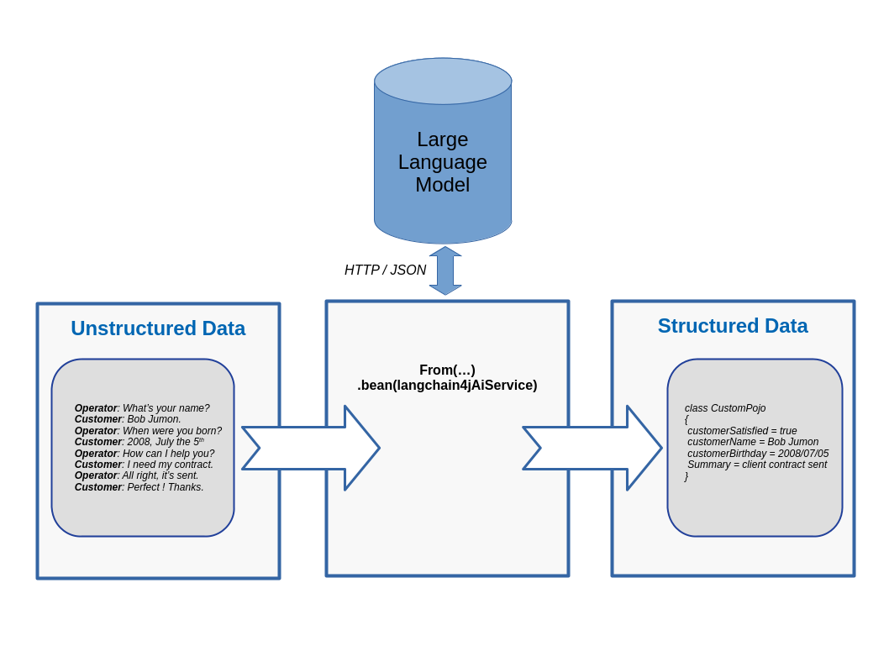

= Unstructured Data Extraction with LangChain4j: A Camel Quarkus example
:cq-example-description: An example that shows how to convert unstructured text data to structured Java objects helped with a Large Language Model and LangChain4j

{cq-description}

TIP: Check the https://camel.apache.org/camel-quarkus/latest/first-steps.html[Camel Quarkus User guide] for prerequisites
and other general information.

Suppose the volume of https://en.wikipedia.org/wiki/Unstructured_data[unstructured data] grows at a high pace in a given organization.
How could one transform those disseminated gold particles into a conform bullion that could be used in banks.
For instance, let's imagine an insurance company that would record the transcripts of the conversation when customers are discussing with the hotline.
There is probably a lot of valuable information that could be extracted from those conversation transcripts.
In this example, we'll convert those text conversations into Java Objects that could then be used in the rest of the Camel route.

In order to achieve this extraction, we'll need a https://en.wikipedia.org/wiki/Large_language_model[Large Language Model (LLM)] and related serving framework that natively supports https://ollama.com/blog/structured-outputs[JSON structured output].
Here, we choose https://ollama.com/library/granite3.3:2b[granite3.3:2b] served through https://ollama.com/[ollama] as it seems compute friendly and under Apache V2 license.
In order to request inference to the served model, we'll use the high-level LangChain4j APIs like https://docs.langchain4j.dev/tutorials/ai-services[AiServices].

=== Start the Large Language Model

Let's start a container to serve the LLM with Ollama, in a first shell type:

[source,shell]
----
docker run --rm -it -v cqex-data-extract-ollama:/root/.ollama -p 11434:11434 --name cqex-data-extract-ollama ollama/ollama:0.9.3
----

After a moment, a log like below should be output:

[source,shell]
----
time=2026-01-06T14:21:55.578Z level=INFO source=types.go:130 msg="inference compute" id=0 library=cpu variant="" compute="" driver=0.0 name="" total="62.2 GiB" available="49.9 GiB"
----

Then, download the codellama model, in a second shell type:

[source,shell]
----
docker exec -it cqex-data-extract-ollama ollama pull granite3.3:2b
----

After a moment, log like below should be output:

[source,shell]
----
pulling manifest 
...
verifying sha256 digest 
writing manifest 
success 
----

That's it, the LLM is now ready to serve our data extraction requests.
The second shell could be reused, however the first one need to stay up while running this example.

=== Package and run the application

You are now ready to package and run the application.

TIP: Find more details about the JVM mode and Native mode in the Package and run section of
https://camel.apache.org/camel-quarkus/latest/first-steps.html#_package_and_run_the_application[Camel Quarkus User guide]

==== JVM mode

[source,shell]
----
mvn clean package -DskipTests
java -jar target/quarkus-app/quarkus-run.jar
----

==== Extracting data from unstructured conversation

Let's atomically copy/move the transcript files to the input folder named `target/transcripts/`, for instance like below:

[source,shell]
----
./send-conversations-to-camel-route.sh
----

The Camel route should output a log as below:

[source,shell]
----
2026-01-06 15:24:48,298 INFO  [route1] (Camel (camel-1) thread #1 - file://target/transcripts) A document has been received by the camel-quarkus-file extension: {
  "id": 1,
  "content": "Operator: Hello, how may I help you ?\nCustomer: Hello, I'm calling because I need to declare an accident on my main vehicle.\nOperator: Ok, can you please give me your name ?\nCustomer: My name is Sarah London.\nOperator: Could you please give me your birth date ?\nCustomer: 1986, July the 10th.\nOperator: Ok, I've got your contract and I'm happy to share with you that we'll be able to reimburse all expenses linked to this accident.\nCustomer: Oh great, many thanks."
}
----

In the first log above, we can see that a JSON file handling transcript related information has been consumed.
The conversation is present in the JSON field named `content`.
This content will be injected into the LLM prompt.

After a few seconds or minutes depending on your hardware setup, the LLM provides an answer strictly conforming to the expected JSON schema.
It's now easy for LangChain4j to convert the returned JSON into a Java Object.
At the end, we are provided with a Plain Old Java Object (POJO) handling the extracted data like below.

[source,shell]
----
2026-01-06 15:24:56,889 INFO  [org.acme.extraction.CustomPojoStore] (Camel (camel-1) thread #1 - file://target/transcripts) An extracted POJO has been added to the store: 
{
    "customerSatisfied": "true",
    "customerName": "Sarah London",
    "customerBirthday": "10 July 1986",
    "summary": "The customer, Sarah London, is calling to declare an accident and seek reimbursement for related expenses."
}
----

.See how the LLM shows its capacity to:
* Extract a human friendly sentiment like `customerSatisfied`
* Exhibits https://nlp.stanford.edu/projects/coref.shtml#:~:text=Overview,question%20answering%2C%20and%20information%20extraction.[coreference resolution], like `customerName` that is deduced from information spread in the whole conversation
* Manage issues related to date format, like the field `customerBirthday`
* Mixed structured and unstructured data (semi-structured data) with the field `summary`.

Notice how all of this is computed simultaneously during a single LLM inference.

At the end, the application should have extracted 3 POJOs.
For each of them, it could be interesting to compare the unstructured input text and the corresponding structured POJO.

Details of the LangChain4j `AiService` setup can be found in class `CustomPojoExtractionService`.

Details of the custom data extract `camel-langchain4j-agent` AI agent implementation can be found in classes `DataExtractAgent` and `DataExtractAgentConfiguration`.

==== Native mode

IMPORTANT: Native mode requires having GraalVM and other tools installed. Please check the Prerequisites section
of https://camel.apache.org/camel-quarkus/latest/first-steps.html#_prerequisites[Camel Quarkus User guide].

If the application is still running in JVM mode, please kill it, for instance with `CTRL+C`.

Now, to prepare a native executable using GraalVM, run the following commands:

[source,shell]
----
mvn clean package -DskipTests -Dnative
./target/*-runner
----

The compilation is a bit slower. Beyond that, notice how the application behaves the same way.
Indeed, you should be able to send the JSON files and see the extracted data exactly as it was done in JVM mode.
The only variation compared to the JVM mode is actually that the application was packaged as a native executable.

== Feedback

Please report bugs and propose improvements via https://github.com/apache/camel-quarkus/issues[GitHub issues of Camel Quarkus] project.
