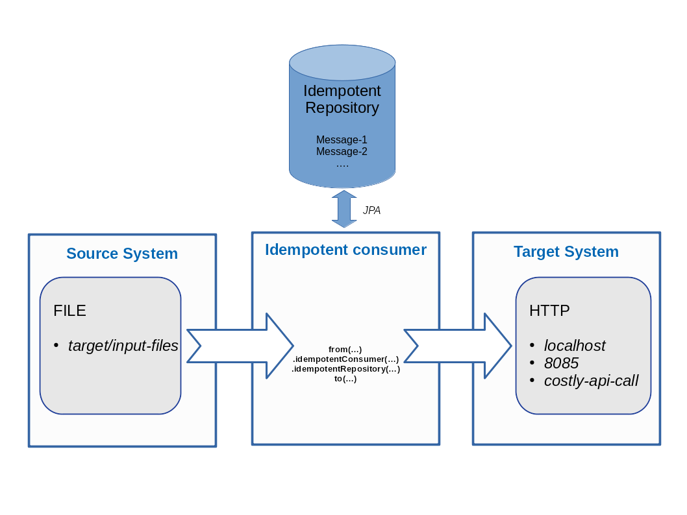

= JPA idempotent repository: A Camel Quarkus example
:cq-example-description: An example that shows how to consume a message only once, even when the message is delivered multiple times

{cq-description}

TIP: Check the https://camel.apache.org/camel-quarkus/latest/first-steps.html[Camel Quarkus User guide] for prerequisites
and other general information.

Suppose an application needs to invoke a costly API. Each time a duplicate message would be processed, then a bunch of money would be lost. In such situations, it could make sense to prevent some duplicate calls by using the https://camel.apache.org/components/latest/eips/idempotentConsumer-eip.html[idempotent consumer] EIP.
Let's see an example with the schema below:

As one could see in the schema, using the idempotent consumer pattern in Camel is as simple as creating a route using the `idempotentConsumer` and `idempotentRepository` keywords. In this example, the idempotent repository is a database that is edited and read through JPA. Under the hood, this database will keep track of messages that have already been processed.

Note that JPA is not the only option when it comes to selecting an `idempotentRepository` implementation.
Other choices are available as listed in the https://camel.apache.org/components/latest/eips/idempotentConsumer-eip.html#_idempotent_consumer_implementations[documentation].

In this example, let's focus on JPA and see more details about how to execute such a route in the next sections below.

== Start in Development mode

Let's start by executing the command below:

[source,shell]
----
mvn clean compile quarkus:dev
----

The above command compiles the project, starts the application and lets the Quarkus tooling watch for changes in your workspace.
Any modifications in your project will automatically take effect in the running application.

TIP: Please refer to the Development mode section of
https://camel.apache.org/camel-quarkus/latest/first-steps.html#_development_mode[Camel Quarkus User guide] for more details.

It should be possible now to see some log messages appearing on the console.
Note how some files with different content are generated `3,5,7...`
Each time such a file is consumed by the route, a costly API is called.
However, a file with content `1` is regularly generated.
This duplicate file is problematic as it will generate undue calls to the costly API too frequently.
This is where the https://camel.apache.org/components/latest/eips/idempotentConsumer-eip.html[idempotent consumer] enter the game.
The source code could be found in the source file named `src/main/java/org/acme/jpa/idempotent/repository/JpaIdempotentRoute.java`.
The camel application should produce logs as below:

[source,shell]
----
2023-09-15 15:47:49,477 INFO  [route2] (Camel (camel-1) thread #2 - timer://createExampleInputFiles) -----------------------------------------------------------------
2023-09-15 15:47:49,478 INFO  [route2] (Camel (camel-1) thread #2 - timer://createExampleInputFiles) Creating an example input file with content 1
2023-09-15 15:47:50,974 INFO  [route1] (Camel (camel-1) thread #1 - file://target/input-files) Received an example input file having the content 1
2023-09-15 15:47:51,167 INFO  [route1] (Camel (camel-1) thread #1 - file://target/input-files) The file was not a duplicate, invoke the costly API
2023-09-15 15:47:51,230 INFO  [org.acm.jpa.ide.rep.CostlyApiService] (vert.x-worker-thread-1) Costly API has been called with new content => GOOD
2023-09-15 15:47:59,475 INFO  [route2] (Camel (camel-1) thread #2 - timer://createExampleInputFiles) -----------------------------------------------------------------
2023-09-15 15:47:59,477 INFO  [route2] (Camel (camel-1) thread #2 - timer://createExampleInputFiles) Creating an example input file with content 3
2023-09-15 15:48:00,758 INFO  [route1] (Camel (camel-1) thread #1 - file://target/input-files) Received an example input file having the content 3
2023-09-15 15:48:00,761 INFO  [route1] (Camel (camel-1) thread #1 - file://target/input-files) The file was not a duplicate, invoke the costly API
2023-09-15 15:48:00,765 INFO  [org.acm.jpa.ide.rep.CostlyApiService] (vert.x-worker-thread-1) Costly API has been called with new content => GOOD
2023-09-15 15:48:09,475 INFO  [route2] (Camel (camel-1) thread #2 - timer://createExampleInputFiles) -----------------------------------------------------------------
2023-09-15 15:48:09,477 INFO  [route2] (Camel (camel-1) thread #2 - timer://createExampleInputFiles) Creating an example input file with content 1
2023-09-15 15:48:10,777 INFO  [route1] (Camel (camel-1) thread #1 - file://target/input-files) Received an example input file having the content 1
2023-09-15 15:48:19,475 INFO  [route2] (Camel (camel-1) thread #2 - timer://createExampleInputFiles) -----------------------------------------------------------------
2023-09-15 15:48:19,477 INFO  [route2] (Camel (camel-1) thread #2 - timer://createExampleInputFiles) Creating an example input file with content 5
2023-09-15 15:48:20,796 INFO  [route1] (Camel (camel-1) thread #1 - file://target/input-files) Received an example input file having the content 5
2023-09-15 15:48:20,801 INFO  [route1] (Camel (camel-1) thread #1 - file://target/input-files) The file was not a duplicate, invoke the costly API
2023-09-15 15:48:20,804 INFO  [org.acm.jpa.ide.rep.CostlyApiService] (vert.x-worker-thread-1) Costly API has been called with new content => GOOD
----

The idempotent consumer is storing the list of already processed messages into a MariaDB database.

If you're wondering how the database schema was created, it happens automatically thanks to `quarkus-flyway`. On application startup, it
creates the `my-db` database and the required `CAMEL_MESSAGEPROCESSED` table. You can find the Flyway migration script at `src/main/resources/db/migration/V1.0.0__add_camel_message_processed.sql`.
You can find more information about Flyway in the https://quarkus.io/guides/flyway[Quarkus Flyway guide].

== Starting and initializing the MariaDB database in a container

Before packaging and running the application in JVM mode, we need to start and initialize a MariaDB database in a container.
So, in a first shell, please launch a MariaDB database container:

[source,shell]
----
docker run -e MARIADB_USER=mariadb -e MARIADB_PASSWORD=mariadb -e MARIADB_DATABASE=my-db -e MARIADB_ROOT_PASSWORD=secret -p 3306:3306 docker.io/mariadb:10.11
----

If successful, you should see the message `mariadbd: ready for connections` output to the console.

=== Package and run the application

Once you are done with developing you may want to package and run the application.

TIP: Find more details about the JVM mode and Native mode in the Package and run section of
https://camel.apache.org/camel-quarkus/latest/first-steps.html#_package_and_run_the_application[Camel Quarkus User guide]

==== JVM mode

[source,shell]
----
mvn clean package -DskipTests
java -jar target/quarkus-app/quarkus-run.jar
----

As mentioned above, `quarkus-flyway` will automatically create the required database and tables for you.

==== Native mode

IMPORTANT: Native mode requires having GraalVM and other tools installed. Please check the Prerequisites section
of https://camel.apache.org/camel-quarkus/latest/first-steps.html#_prerequisites[Camel Quarkus User guide].

To prepare a native executable using GraalVM, run the following commands:

[source,shell]
----
mvn clean package -DskipTests -Pnative
./target/*-runner
----

The compilation is a bit slower. Beyond that, notice how the application behaves the same way.
The only variation compared to the JVM mode is actually that the application was packaged as a native executable.

==== Deploying to Kubernetes

You can build a container image for the application like this. Refer to the https://quarkus.io/guides/deploying-to-kubernetes[Quarkus Kubernetes guide] for options around customizing image names, registries etc.

[source,shell]
----
mvn clean package -DskipTests -Dquarkus.container-image.build=true
----

If you are using a local development cluster like Kind or k3s, you can use host the container image on your local host. Or, with minikube, use the Docker daemon from the cluster virtual machine `eval $(minikube docker-env)`. Otherwise, you'll need to push the image to a registry of your choosing.

Next apply the necessary resources to the cluster if needed:

[source,shell]
----
kubectl apply -f target/kubernetes/kubernetes.yml
----

TIP: You can build & deploy in one single step by doing `mvn clean package -DskipTests -Dquarkus.kubernetes.deploy=true`

Check pods are running by executing:

[source,shell]
----
kubectl get pods
----

We expect a list of three pods similar to below.
Note that the `camel-quarkus-examples-jpa-idempotent-repository-flyway` pod will transition from `running` to `completed`, after it has completed initializing the MariaDB database.

[source,shell]
----
NAME                                                              READY   STATUS    RESTARTS      AGE
camel-quarkus-examples-mariadb-database-deployment-76f6dc9bdnwwxn   1/1     Running   0             23s
camel-quarkus-examples-jpa-idempotent-repository-flyway-in2q5n5   0/1     Completed   0              23s
camel-quarkus-examples-jpa-idempotent-repository-7c74b9cf5ph68r   1/1     Running   1 (18s ago)   23s
----

Now, let's tail the application logs:

[source,shell]
----
kubectl logs -f camel-quarkus-examples-jpa-idempotent-repository-56999fcffb6qv2
----

To clean up do:

[source,shell]
----
kubectl delete all -l app.kubernetes.io/name=camel-quarkus-examples-jpa-idempotent-repository
kubectl delete all -l job-name=camel-quarkus-examples-jpa-idempotent-repository-flyway-init
kubectl delete all -l app.kubernetes.io/name=camel-quarkus-examples-mariadb-database
----

[NOTE]
====
If you need to configure container resource limits & requests, or enable the Quarkus Kubernetes client to trust self signed certificates, you can find these configuration options in `src/main/resources/application.properties`. Simply uncomment them and set your desired values.
====

==== Deploying to OpenShift

In order to start a Source To Image (S2I) build and deploy the application, let's execute the command below:

[source,shell]
----
mvn clean package -DskipTests -Dquarkus.kubernetes.deploy=true -Dopenshift
----

You can check the pod status and tail logs using the commands mentioned above in the Kubernetes section. Use the `oc` binary instead of `kubectl` if preferred.

== Feedback

Please report bugs and propose improvements via https://github.com/apache/camel-quarkus/issues[GitHub issues of Camel Quarkus] project.
