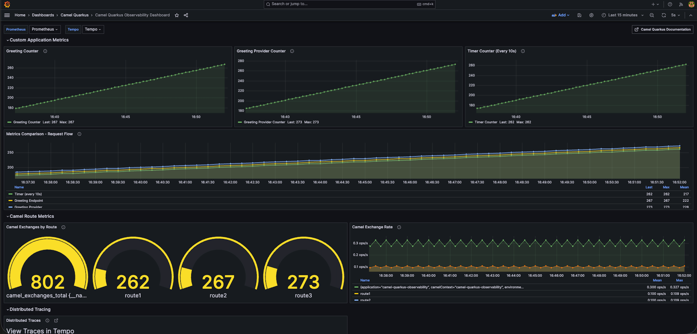

= Observability: A Camel Quarkus example
:cq-example-description: An example that demonstrates how to add support for metrics, health checks and distributed tracing

{cq-description}

TIP: Check the https://camel.apache.org/camel-quarkus/latest/first-steps.html[Camel Quarkus User guide] for prerequisites
and other general information.

== Start in Development mode

[source,shell]
----
$ mvn clean compile quarkus:dev
----

The above command compiles the project, starts the application and lets the Quarkus tooling watch for changes in your
workspace. Any modifications in your project will automatically take effect in the running application.

TIP: Please refer to the Development mode section of
https://camel.apache.org/camel-quarkus/latest/first-steps.html#_development_mode[Camel Quarkus User guide] for more details.

=== Camel Observability Services

This project includes the `camel-quarkus-observability-services` extension.
This provides some opinionated observability configuration and simplifies your application.

It comes with the following capabilities.

* `camel-quarkus-microprofile-health` for health checks
* `camel-quarkus-management` for JMX monitoring and management
* `camel-quarkus-micrometer` for Micrometer metrics, together with support for exporting them in Prometheus format
* `camel-quarkus-opentelemetry2` for tracing

The `camel-quarkus-observability-services` extension exposes the above capabilities under a common HTTP endpoint context path of `/observe`.

=== Metrics

You can benefit from both of the https://camel.apache.org/components/next/micrometer-component.html[Camel Micrometer] and https://quarkus.io/guides/micrometer[Quarkus Micrometer] worlds.
We are able to use multiple ways of creating meters for our custom metrics.

First using Camel micrometer component (see link:src/main/java/org/acme/observability/Routes.java[Routes.java]):

[source, java]
----
.to("micrometer:counter:org.acme.observability.greeting-provider?tags=type=events,purpose=example")
----

Which will count each call to the `platform-http:/greeting-provider` endpoint.

The second approach is to benefit from CDI dependency injection of the `MeterRegistry`:

[source, java]
----
@Inject
MeterRegistry registry;
----

Then using it directly in a Camel `Processor` method to publish metrics:

[source, java]
----
void countGreeting(Exchange exchange) {
    registry.counter("org.acme.observability.greeting", "type", "events", "purpose", "example").increment();
}
----

[source, java]
----
from("platform-http:/greeting")
    .removeHeaders("*")
    .process(this::countGreeting)
----

This counts each call to the `platform-http:/greeting` endpoint.

Finally, the last approach is to use https://quarkus.io/guides/micrometer#does-micrometer-support-annotations[Micrometer annotations], by defining a bean link:src/main/java/org/acme/observability/micrometer/TimerCounter.java[TimerCounter.java] as follows:

[source, java]
----
@ApplicationScoped
@Named("timerCounter")
public class TimerCounter {

    @Counted(value = "org.acme.observability.timer-counter", extraTags = { "purpose", "example" })
    public void count() {
    }
}
----

It can then be invoked from Camel via the bean EIP (see link:src/main/java/org/acme/observability/TimerRoute.java[TimerRoute.java]):

[source, java]
----
.bean("timerCounter", "count")
----

It will increment the counter metric each time the Camel timer is fired.

=== Metrics endpoint

Metrics are exposed on an HTTP endpoint at `/observe/metrics` on port `9876`.

NOTE: Note we are using a different port (9876) for the management endpoint then our application (8080) is listening on.
This is configured in `application.properties` with `quarkus.management.enabled = true`. See the https://quarkus.io/guides/management-interface-reference[Quarkus management interface guide] for more information.

To view all Camel metrics do:

[source,shell]
----
$ curl -s localhost:9876/observe/metrics
----

To view only our previously created metrics, use:

[source,shell]
----
$ curl -s localhost:9876/observe/metrics | grep -i 'purpose="example"'
----

and you should see 3 lines of different metrics (with the same value, as they are all triggered by the timer).

NOTE: Maybe you've noticed the Prometheus output format. If you would rather use the JSON format, please follow the Quarkus Micrometer management interface https://quarkus.io/guides/micrometer#management-interface[configuration guide].

=== Health endpoint

Camel provides some out of the box liveness and readiness checks. To see this working, interrogate the `/observe/health/live` and `/observe/health/ready` endpoints on port `9876`:

[source,shell]
----
$ curl -s localhost:9876/observe/health/live
----

[source,shell]
----
$ curl -s localhost:9876/observe/health/ready
----

The JSON output will contain a checks for verifying whether the `CamelContext` and each individual route is in the 'Started' state.

This example project contains a custom liveness check class `CustomLivenessCheck` and custom readiness check class `CustomReadinessCheck` which leverage the Camel health API.
You'll see these listed in the health JSON as 'custom-liveness-check' and 'custom-readiness-check'. On every 5th invocation of these checks, the health status of `custom-liveness-check` will be reported as DOWN.

You can also directly leverage MicroProfile Health APIs to create checks. Class `CamelUptimeHealthCheck` demonstrates how to register a readiness check.

=== Tracing

To be able to diagnose problems in Camel Quarkus applications, it's useful to instrument method calls, HTTP interactions etc with OpenTelemetry.

This example is pre-configured to send traces to Tempo via OTLP on `http://localhost:4317`. The behavior differs based on how you run the application:

==== Dev Mode (quarkus:dev)

When running `mvn clean compile quarkus:dev`, the Quarkus Observability dev service is automatically enabled (see https://quarkus.io/guides/observability-devservices-lgtm[Observability Dev Services with Grafana OTel LGTM]).

The dev service automatically:
- Starts a Grafana LGTM container with Tempo for tracing
- Overrides the `quarkus.otel.exporter.otlp.traces.endpoint` property to point to the dev service container
- Assigns a random port to Grafana (check logs for `grafana.endpoint=http://localhost:XXXXX`)

To view traces in dev mode, find the Grafana endpoint in logs and browse to it.

==== Docker Compose Mode (Recommended)

When running the packaged application with Docker Compose (see Grafana Dashboards section above), traces are sent to the Tempo container at `localhost:4317`.

The OpenTelemetry configuration in `application.properties` is already set:

[source, text]
----
quarkus.otel.exporter.otlp.traces.endpoint = http://localhost:4317
quarkus.otel.sdk.disabled=false
----

Traces are automatically visible in Grafana at http://localhost:3000.

==== Cloud/Kubernetes Deployment

For cloud or Kubernetes deployments, override the OTLP endpoint using an environment variable:

[source, shell]
----
export QUARKUS_OTEL_EXPORTER_OTLP_TRACES_ENDPOINT=http://tempo-service:4317
----

Or use property placeholders in `application.properties`:

[source, text]
----
quarkus.otel.exporter.otlp.traces.endpoint = http://${TEMPO_HOST:localhost}:4317
----

NOTE: For information about other OpenTelemetry exporters, refer to the Camel Quarkus OpenTelemetry https://camel.apache.org/camel-quarkus/next/reference/extensions/opentelemetry.html#extensions-opentelemetry-usage-exporters[extension documentation].

==== Understanding Traces

The `platform-http` consumer route introduces a random delay to simulate latency, hence the overall time of each trace should be different. When viewing a trace, you should see
a hierarchy of 8 spans showing the progression of the message exchange through each endpoint.

=== Grafana Dashboards

This example includes a pre-configured Grafana dashboard to visualize metrics, distributed traces, and JVM statistics.

==== Quick Start with Docker Compose (Recommended)

The easiest way to visualize the dashboard with working metrics is using Docker Compose with static ports:

[source,shell]
----
# Start the observability stack (Grafana, Prometheus, Tempo)
$ docker compose -f src/main/docker/docker-compose-grafana.yml up -d

# In another terminal, package and run the application
$ mvn clean package -DskipTests
$ java -jar target/quarkus-app/quarkus-run.jar
----

Access Grafana at http://localhost:3000 (credentials: `admin/admin`). The dashboard is automatically provisioned and ready to use!

NOTE: To stop the observability stack: `docker compose -f src/main/docker/docker-compose-grafana.yml down -v`

==== Alternative: Dev Mode with Manual Dashboard Import

When running in dev mode, Quarkus automatically provisions a Grafana instance with dynamic ports:

[source,shell]
----
$ mvn clean compile quarkus:dev
----

IMPORTANT: The LGTM dev services Grafana can display *distributed traces* but cannot display *metrics* from the dashboard panels. This is because the Prometheus instance inside the LGTM container cannot scrape metrics from `localhost:9876` on the host machine. For full dashboard functionality, use the Docker Compose setup above.

To view traces in dev mode:

1. Find the Grafana endpoint in logs: `grafana.endpoint=http://localhost:XXXXX`
2. Access Grafana (credentials: `admin/admin`)
3. Navigate to *Explore* → Select *Tempo* datasource
4. Query traces with: `{name="POST /greeting"}`

==== Dashboard Contents

The Camel Quarkus Observability Dashboard includes four main sections:

*Custom Application Metrics*

- *Greeting Counter*: Tracks calls to the `/greeting` endpoint (incremented via CDI MeterRegistry)
- *Greeting Provider Counter*: Tracks calls to `/greeting-provider` endpoint (incremented via Camel micrometer component)
- *Timer Counter*: Automatically increments every 10 seconds (incremented via @Counted annotation)
- *Metrics Comparison*: Shows correlation between timer, greeting, and provider calls

*Camel Route Metrics*

- *Camel Exchanges by Route*: Total number of messages processed per route
- *Camel Exchange Rate*: Messages per second across all routes

*Distributed Tracing*

- *Distributed Traces*: Information panel with link to Tempo Explore for viewing detailed traces

*JVM & System Metrics*

- *JVM Memory Usage*: Heap and non-heap memory consumption
- *CPU Usage*: Process and system CPU utilization
- *Garbage Collection Pause Time*: GC pause duration by type
- *Active HTTP Connections*: Current number of active requests

==== What You'll See

When the application is running, the dashboard will show:

- *Timer Counter*: Increments automatically every 10 seconds (from the timer route)
- *Greeting Metrics*: Increase when you call the endpoint:
+
[source,shell]
----
$ curl localhost:8080/greeting
----

- *Distributed Traces*: Click "Open Tempo Explore" to view complete trace hierarchy with 8 spans showing message flow through Camel endpoints
- *JVM Metrics*: Real-time memory, CPU, and GC statistics

TIP: The dashboard auto-refreshes every 5 seconds. Generate some traffic using `curl` in a loop to see the metrics change in real-time.

==== Docker Compose Details

The Docker Compose setup includes:

- *Grafana* on http://localhost:3000 with the dashboard automatically provisioned
- *Prometheus* on http://localhost:9090 scraping metrics from the application every 5 seconds
- *Tempo* on http://localhost:3200 receiving distributed traces via OTLP

The application exposes:
- Metrics at `http://localhost:9876/observe/metrics` (scraped by Prometheus)
- Traces sent to Tempo at `http://localhost:4317` (OTLP gRPC)
- Health checks at `http://localhost:9876/observe/health/live` and `/observe/health/ready`

All services use **static ports** for easy access and documentation.

=== Jolokia & Hawtio

It can be useful to leverage Camel's JMX management features to manage and introspect the application.

You can interact with the https://jolokia.org[Jolokia] endpoint using cURL. For example to fetch information about the `CamelContext`.

[source,shell]
----
$ curl -s 'http://localhost:8778/jolokia/read/org.apache.camel:context=*,type=context,name=*' | jq
----

https://hawt.io/[Hawtio] can be used to visualize your Camel routes. https://www.jbang.dev/[JBang] is a convenient way to get started.

[source,shell]
----
$ jbang app install hawtio@hawtio/hawtio
$ hawtio --port 8085
----

When this example project is run in dev mode, it will be discoverable from Hawtio via the 'Discover' tab.
When running the application from the runnable JAR or native binary, you'll need to choose 'Add Connection' from the 'Remote' tab and add a connection for http://localhost:8778/jolokia/.

When deploying to Kubernetes or Openshift, you can use https://github.com/hawtio/hawtio-online[Hawtio Online]. The `camel-quarkus-jolokia` extension will automatically configure the application to be discoverable from the Hawtio Online console.

=== Package and run the application

Once you are done with developing you may want to package and run the application.

TIP: Find more details about the JVM mode and Native mode in the Package and run section of
https://camel.apache.org/camel-quarkus/latest/first-steps.html#_package_and_run_the_application[Camel Quarkus User guide]

==== JVM mode

[source,shell]
----
$ mvn clean package
$ java -jar target/quarkus-app/quarkus-run.jar
...
[io.quarkus] (main) camel-quarkus-examples-... started in 1.163s. Listening on: http://0.0.0.0:8080
----

==== Native mode

IMPORTANT: Native mode requires having GraalVM and other tools installed. Please check the Prerequisites section
of https://camel.apache.org/camel-quarkus/latest/first-steps.html#_prerequisites[Camel Quarkus User guide].

To prepare a native executable using GraalVM, run the following command:

[source,shell]
----
$ mvn clean package -Dnative
$ ./target/*-runner
...
[io.quarkus] (main) camel-quarkus-examples-... started in 0.013s. Listening on: http://0.0.0.0:8080
...
----

== Feedback

Please report bugs and propose improvements via https://github.com/apache/camel-quarkus/issues[GitHub issues of Camel Quarkus] project.
