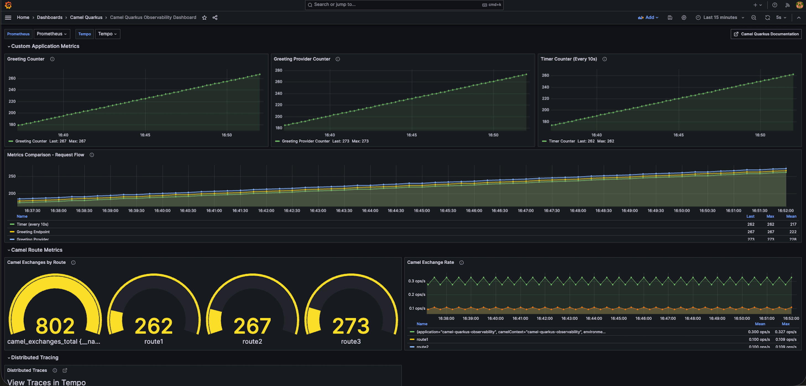

= Observability: A Camel Quarkus example
:cq-example-description: An example that demonstrates how to add support for metrics, health checks and distributed tracing

{cq-description}

TIP: Check the https://camel.apache.org/camel-quarkus/latest/first-steps.html[Camel Quarkus User guide] for prerequisites
and other general information.

== Start in Development mode

[source,shell]
----
mvn clean compile quarkus:dev
----

The above command compiles the project, starts the application and lets the Quarkus tooling watch for changes in your
workspace. Any modifications in your project will automatically take effect in the running application.

TIP: Please refer to the Development mode section of
https://camel.apache.org/camel-quarkus/latest/first-steps.html#_development_mode[Camel Quarkus User guide] for more details.

NOTE: Dev mode requires a working container runtime such as Docker or Podman. The Quarkus Observability dev service
uses it to run a Grafana OTel LGTM container, which the application exports traces to. See the <<_tracing,Tracing>>
section for details. Set `quarkus.observability.enabled=false` if you would rather not have the container started.

=== Camel Observability Services

This project includes the `camel-quarkus-observability-services` extension.
This provides some opinionated observability configuration and simplifies your application.

It comes with the following capabilities.

* `camel-quarkus-microprofile-health` for health checks
* `camel-quarkus-management` for JMX monitoring and management
* `camel-quarkus-micrometer` for Micrometer metrics, together with support for exporting them in Prometheus format
* `camel-quarkus-opentelemetry2` for tracing

The `camel-quarkus-observability-services` extension exposes the above capabilities under a common HTTP endpoint context path of `/observe`.

=== Metrics

You can benefit from both of the https://camel.apache.org/components/next/micrometer-component.html[Camel Micrometer] and https://quarkus.io/guides/micrometer[Quarkus Micrometer] worlds.
You can create meters in multiple ways for custom metrics.

First using Camel micrometer component (see link:src/main/java/org/acme/observability/Routes.java[Routes.java]):

[source, java]
----
.to("micrometer:counter:org.acme.observability.greeting-provider?tags=type=events,purpose=example")
----

Which will count each call to the `platform-http:/greeting-provider` endpoint.

The second approach is to benefit from CDI dependency injection of the `MeterRegistry`:

[source, java]
----
@Inject
MeterRegistry registry;
----

Then using it directly in a Camel `Processor` method to publish metrics:

[source, java]
----
void countGreeting(Exchange exchange) {
    registry.counter("org.acme.observability.greeting", "type", "events", "purpose", "example").increment();
}
----

[source, java]
----
from("platform-http:/greeting")
    .removeHeaders("*")
    .process(this::countGreeting)
----

This counts each call to the `platform-http:/greeting` endpoint.

Finally, the last approach is to use https://quarkus.io/guides/micrometer#does-micrometer-support-annotations[Micrometer annotations], by defining a bean link:src/main/java/org/acme/observability/micrometer/TimerCounter.java[TimerCounter.java] as follows:

[source, java]
----
@ApplicationScoped
@Named("timerCounter")
public class TimerCounter {

    @Counted(value = "org.acme.observability.timer-counter", extraTags = { "purpose", "example" })
    public void count() {
    }
}
----

It can then be invoked from Camel via the bean EIP (see link:src/main/java/org/acme/observability/TimerRoute.java[TimerRoute.java]):

[source, java]
----
.bean("timerCounter", "count")
----

It will increment the counter metric each time the Camel timer is fired.

=== Metrics endpoint

Metrics are exposed on an HTTP endpoint at `/observe/metrics` on port `9876`.

NOTE: Note we are using a different port (9876) for the management endpoint then our application (8080) is listening on.
This is configured in `application.properties` with `quarkus.management.enabled = true`. See the https://quarkus.io/guides/management-interface-reference[Quarkus management interface guide] for more information.

To view all Camel metrics do:

[source,shell]
----
curl -s localhost:9876/observe/metrics
----

To view only our previously created metrics, use:

[source,shell]
----
curl -s localhost:9876/observe/metrics | grep -i 'purpose="example"'
----

and you should see 3 lines of different metrics (with the same value, as they are all triggered by the timer).

NOTE: Maybe you've noticed the Prometheus output format. If you would rather use the JSON format, please follow the Quarkus Micrometer management interface https://quarkus.io/guides/micrometer#management-interface[configuration guide].

In dev mode only, the same registry is also served from `localhost:8080/q/metrics`, so that the Grafana dev service
can scrape it. See <<_dev_mode_metrics,Dev mode metrics>>.

=== Health endpoint

Camel provides some out of the box liveness and readiness checks. To see this working, interrogate the `/observe/health/live` and `/observe/health/ready` endpoints on port `9876`:

[source,shell]
----
curl -s localhost:9876/observe/health/live
----

[source,shell]
----
curl -s localhost:9876/observe/health/ready
----

The JSON output will contain a checks for verifying whether the `CamelContext` and each individual route is in the 'Started' state.

This example project contains a custom liveness check class `CustomLivenessCheck` and custom readiness check class `CustomReadinessCheck` which leverage the Camel health API.
You'll see these listed in the health JSON as 'custom-liveness-check' and 'custom-readiness-check'. On every 5th invocation of these checks, the health status of `custom-liveness-check` will be reported as DOWN.

You can also directly leverage MicroProfile Health APIs to create checks. Class `CamelUptimeHealthCheck` demonstrates how to register a readiness check.

=== Tracing

To be able to diagnose problems in Camel Quarkus applications, it's useful to instrument method calls, HTTP interactions etc with OpenTelemetry.

The OpenTelemetry SDK is disabled by default by `camel-quarkus-observability-services`, so `application.properties` enables it:

[source, properties]
----
quarkus.otel.sdk.disabled=false
----

Note that no OTLP exporter endpoint is configured. Where the traces are sent depends on how the application is run.

==== Dev mode

In dev mode, the https://quarkus.io/guides/observability-devservices-lgtm[Grafana OTel LGTM dev service] starts a
container running Grafana, Tempo, Loki, Prometheus and an OpenTelemetry collector, and configures the application to
export to it.

NOTE: Do not set `quarkus.otel.exporter.otlp.endpoint` (or its per signal variants) in `application.properties`. It
takes precedence over what the dev service configures, and traces then go nowhere.

Grafana is at http://localhost:3000 (`admin` / `admin`). The port is pinned with
`%dev.quarkus.observability.lgtm.grafana-port` so that it does not change on every restart.

To view traces, choose *Explore*, select the *Tempo* data source and search for `{name="POST /greeting"}` - the timer
route produces one of those every 10 seconds. Requests you send yourself show up as `{name="GET /greeting"}`:

[source,shell]
----
curl -s localhost:8080/greeting
----

Metrics and logs land in the same Grafana instance, see the <<_grafana_dashboard,Grafana dashboard>> section.

==== Package and run

When the packaged application is run outside of dev mode, there is no dev service and the Quarkus defaults apply, which
is OTLP over gRPC to `http://localhost:4317`. Point the application at your own collector, Tempo or Jaeger instance with:

[source,shell]
----
export QUARKUS_OTEL_EXPORTER_OTLP_ENDPOINT=http://my-collector:4317
----

Or configure it in `application.properties`:

[source, properties]
----
quarkus.otel.exporter.otlp.endpoint = http://${OTEL_COLLECTOR_HOST:localhost}:4317
----

NOTE: For information about other OpenTelemetry exporters, refer to the Camel Quarkus OpenTelemetry https://camel.apache.org/camel-quarkus/next/reference/extensions/opentelemetry.html#extensions-opentelemetry-usage-exporters[extension documentation].

==== Understanding traces

The `platform-http` consumer route introduces a random delay to simulate latency, hence the overall time of each trace
should be different. When viewing a trace, you should see a hierarchy of spans showing the progression of the message
exchange, from the inbound `platform-http` request, through the HTTP call to the `/greeting-provider` endpoint, down to
the individual Camel processors.

=== Grafana dashboard

This example ships a Grafana dashboard at
link:src/main/resources/META-INF/grafana/grafana-dashboard-camel-quarkus-observability.json[grafana-dashboard-camel-quarkus-observability.json].
Any dashboard placed in `META-INF/grafana` is provisioned automatically into the Grafana instance of the LGTM dev
service, so in dev mode it is available straight away, listed as *Camel Quarkus Observability Dashboard*.

It is organised in four sections:

*Custom Application Metrics*

- *Greeting Counter*: Tracks calls to the `/greeting` endpoint (incremented via CDI MeterRegistry)
- *Greeting Provider Counter*: Tracks calls to `/greeting-provider` endpoint (incremented via Camel micrometer component)
- *Timer Counter*: Automatically increments every 10 seconds (incremented via @Counted annotation)
- *Metrics Comparison*: Shows correlation between timer, greeting, and provider calls

*Camel Route Metrics*

- *Camel Exchanges by Route*: Total number of messages processed per route
- *Camel Exchange Rate*: Messages per second across all routes

*Distributed Tracing*

- *Distributed Traces*: Information panel describing how to view traces in Tempo

*JVM & System Metrics*

- *JVM Memory Usage*: Heap and non-heap memory consumption
- *CPU Usage*: Process and system CPU utilization
- *Garbage Collection Pause Time*: GC pause duration by type
- *Active HTTP Connections*: Current number of active requests

The dashboard auto-refreshes every 5 seconds. The timer route drives some of the metrics on its own, and you can
generate more traffic with `curl localhost:8080/greeting` in a loop.

==== Dev mode metrics

The dev service can only scrape metrics from the application HTTP port, whereas `camel-quarkus-observability-services`
serves them from the management interface. To bridge that gap,
link:src/main/java/org/acme/observability/devmode/DevModeMetricsEndpoint.java[DevModeMetricsEndpoint.java] exposes the
same registry on `/q/metrics` in dev mode. It is not part of the packaged application.

IMPORTANT: On Linux, uncomment the following in `application.properties`, otherwise the dev service cannot reach the
application and the metrics panels stay empty.

[source, properties]
----
%dev.quarkus.http.host = 0.0.0.0
----

==== Logs

`quarkus.otel.logs.enabled=true` exports log records over OTLP as well. They are searchable in Loki via *Explore* or
the bundled *Quarkus OpenTelemetry Logging* dashboard, and each record carries the `trace_id` and `span_id` of the
exchange that produced it.

=== Jolokia & Hawtio

It can be useful to leverage Camel's JMX management features to manage and introspect the application.

You can interact with the https://jolokia.org[Jolokia] endpoint using cURL. For example to fetch information about the `CamelContext`.

[source,shell]
----
curl -s 'http://localhost:8778/jolokia/read/org.apache.camel:context=*,type=context,name=*' | jq
----

https://hawt.io/[Hawtio] can be used to visualize your Camel routes. https://www.jbang.dev/[JBang] is a convenient way to get started.

[source,shell]
----
jbang app install hawtio@hawtio/hawtio
hawtio --port 8085
----

When this example project is run in dev mode, it will be discoverable from Hawtio via the 'Discover' tab.
When running the application from the runnable JAR or native binary, you'll need to choose 'Add Connection' from the 'Remote' tab and add a connection for http://localhost:8778/jolokia/.

When deploying to Kubernetes or Openshift, you can use https://github.com/hawtio/hawtio-online[Hawtio Online]. The `camel-quarkus-jolokia` extension configures SSL client authentication automatically, but you must also uncomment the following properties in `application.properties`.

[source,properties]
----
quarkus.camel.jolokia.server.host=0.0.0.0
quarkus.camel.jolokia.remote-access-allowed=true
----

The Jolokia agent binds to `localhost` by default, which is unreachable from outside the pod, and the default restrictor rejects requests from non-loopback addresses.

=== Package and run the application

Once you are done with developing you may want to package and run the application.

TIP: Find more details about the JVM mode and Native mode in the Package and run section of
https://camel.apache.org/camel-quarkus/latest/first-steps.html#_package_and_run_the_application[Camel Quarkus User guide]

==== JVM mode

[source,shell]
----
mvn clean package
java -jar target/quarkus-app/quarkus-run.jar
...
[io.quarkus] (main) camel-quarkus-examples-... started in 1.163s. Listening on: http://0.0.0.0:8080
----

==== Native mode

IMPORTANT: Native mode requires having GraalVM and other tools installed. Please check the Prerequisites section
of https://camel.apache.org/camel-quarkus/latest/first-steps.html#_prerequisites[Camel Quarkus User guide].

To prepare a native executable using GraalVM, run the following command:

[source,shell]
----
mvn clean package -Dnative
./target/*-runner
...
[io.quarkus] (main) camel-quarkus-examples-... started in 0.013s. Listening on: http://0.0.0.0:8080
...
----

== Feedback

Please report bugs and propose improvements via https://github.com/apache/camel-quarkus/issues[GitHub issues of Camel Quarkus] project.
