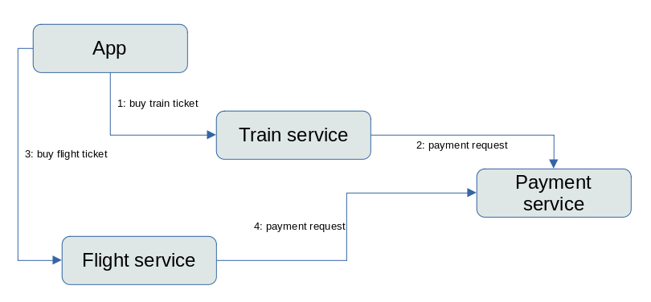
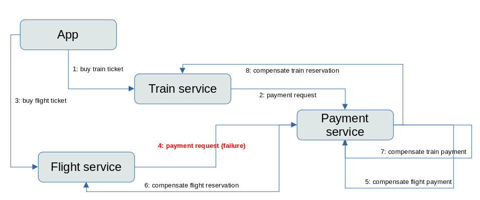
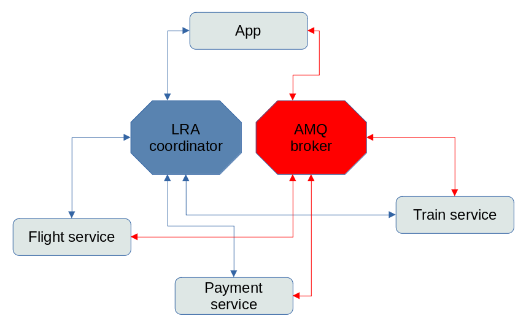

= Saga and LRA: A Camel Quarkus example
:cq-example-description: An example that shows how to use saga and lra

{cq-description}

TIP: Check the https://camel.apache.org/camel-quarkus/latest/first-steps.html[Camel Quarkus User guide] for prerequisites
and other general information.

=== How it works

There are 4 services as participants of the Saga:

- payment-service: it emulates a real payment transaction and it will be used by both flight-service and train-service
- flight-service: it emulates the booking of a flight ticket and it uses the payment-service to execute a payment transaction
- train-service: it emulates the reservation of a train seat and it uses the payment-service to execute a payment transaction
- app: is the starting point and it emulates a user that starts the transaction to buy both flight and train tickets

The starting point is a REST endpoint that creates a request for a new reservation
and there is 15% probability that the payment service fails.

==== Logical view

==== Compensating a failure

==== Technical view

The communication between services and LRA coordinator (blue connectors) is via HTTP protocol,
so every service expose REST endpoints called by the LRA, moreover it calls LRA via REST endpoint

The communication between services (red connectors) is via AMQ broker (using OPENWIRE protocol),
implemented using Camel JMS component and RequestReply EIP
obtaining a synchronous behavior using asynchronous protocol

==== Analyzing logs

In the logs there will be all the messages about the execution of the service.

First the app starts the saga LRA, passing the id to the entry point REST

[source,shell]
----
curl -X POST http://localhost:8084/api/saga?id=1
----

in the log

[source]
----
Executing saga #1 with LRA http://localhost:8080/lra-coordinator/0_ffff7f000001_8aad_62d16f11_2
----

where the URL contains the id of the LRA and the number of the saga is the value of the parameter passed to the rest in the starting point

We're expecting that if the payment is ok, the message in the payment service will be:

[source]
----
Paying train for order #1

Payment train done for order #1 with payment transaction xxxxx

Payment flight done for order #1 with payment transaction xxxxx
----

the value of the payment transaction is the `JMSCorrelationID` used in the RequestReply EIP in the payment service

If the random failure occurs, the log in the payment service will be

[source]
----
Payment flight for saga #65 fails!

Payment for order #65 has been cancelled
----

It means that the compensation for the payment has been called, so we expect that in the flight service there will be a log

[source]
----
Flight purchase #65 has been cancelled due to payment failure
----

in the train service

[source]
----
Train purchase #65 has been cancelled due to payment failure
----

in the app

[source]
----
Transaction http://localhost:8080/lra-coordinator/0_ffff7f000001_8aad_62d16f11_74 has been cancelled due to flight or train failure
----

=== Package and run the application

Once you are done with developing you may want to package and run the application.

TIP: Find more details about the JVM mode and Native mode in the Package and run section of
https://camel.apache.org/camel-quarkus/latest/first-steps.html#_package_and_run_the_application[Camel Quarkus User guide]

==== External systems

Start Artemis:

[source, shell]
----
docker run --name artemis \
  -e AMQ_USER=admin -e AMQ_PASSWORD=admin \
  -d -p 61616:61616 \
  quay.io/artemiscloud/activemq-artemis-broker
----

Start Narayana LRA Coordinator Server:

[source, shell]
----
docker run --network host -e QUARKUS_HTTP_PORT=8080 quay.io/jbosstm/lra-coordinator:latest
----

==== JVM mode

[source,shell]
----
$ mvn clean package
----

==== Native mode

IMPORTANT: Native mode requires having GraalVM and other tools installed. Please check the Prerequisites section
of https://camel.apache.org/camel-quarkus/latest/first-steps.html#_prerequisites[Camel Quarkus User guide].

To prepare a native executable using GraalVM, run the following command:

[source,shell]
----
$ mvn clean package -Pnative
----

==== Run script to execute services locally

[source,shell]
----
./run.sh
----

It will generate all the java processes and start in dev mode, logs are stored in the `.log` files, and process id in the `.pid` files

==== Run script to stop services locally

[source,shell]
----
./stop.sh
----

This command will kill the running processes, remove the PID files; the log files will be left

== Feedback

Please report bugs and propose improvements via https://github.com/apache/camel-quarkus/issues[GitHub issues of Camel Quarkus] project.
